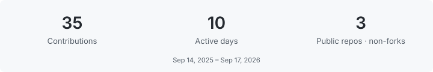
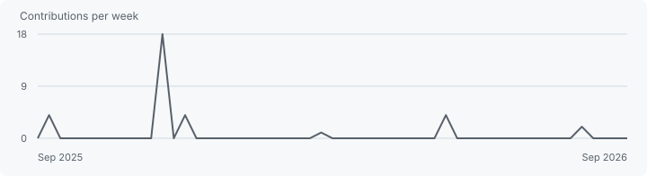

  

<h3 align="center">Hi, I'm Israel.</h3>

  Developer · Mexico City 
  Turning ideas into useful software.

  <a href="https://github.com/israSanchezFal?tab=repositories">Explore my work ↗</a>

### About me

I'm a developer based in Mexico City, learning through hands-on projects in programming, databases, and APIs. My public work includes Java exercises and a traffic-data project built with Python and PostgreSQL.

Currently exploring how to turn structured data into useful applications, one project at a time.

### Connect

  
  &nbsp;
  
  &nbsp;
  

### Tech stack

`Java` · `TypeScript` · `Python` · `React` · `FastAPI`

`PostgreSQL` · `MongoDB` · `Cassandra` · `Supabase` · `SQLAlchemy`

`Docker` · `Git` · `GitHub`

### GitHub stats

### Activity graph

